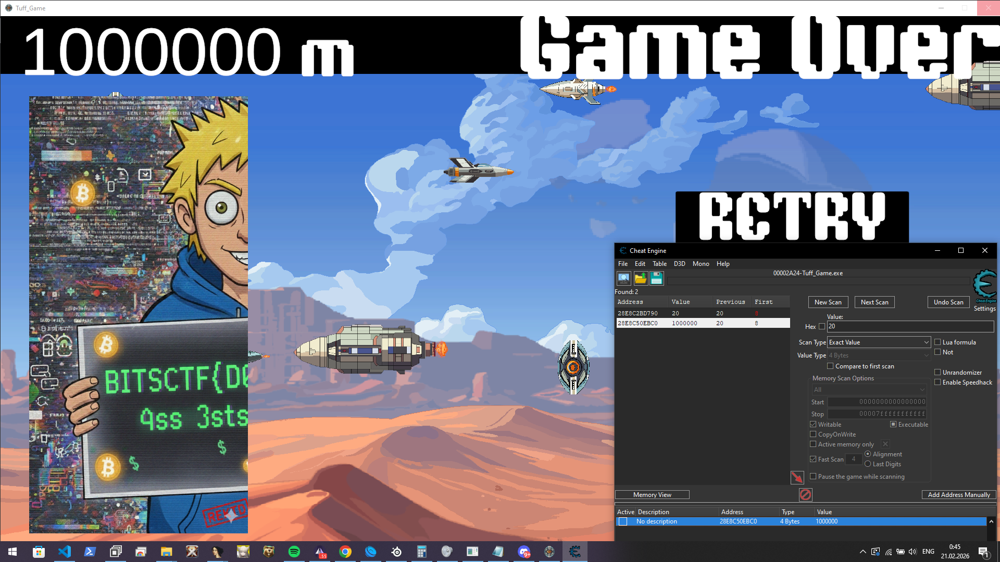
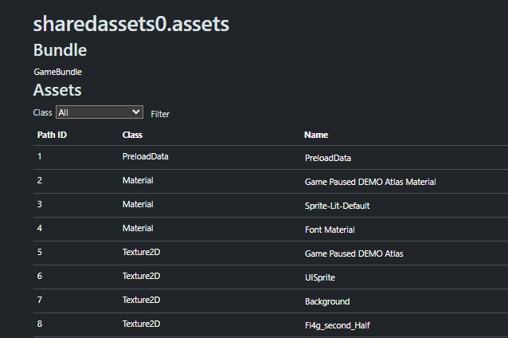
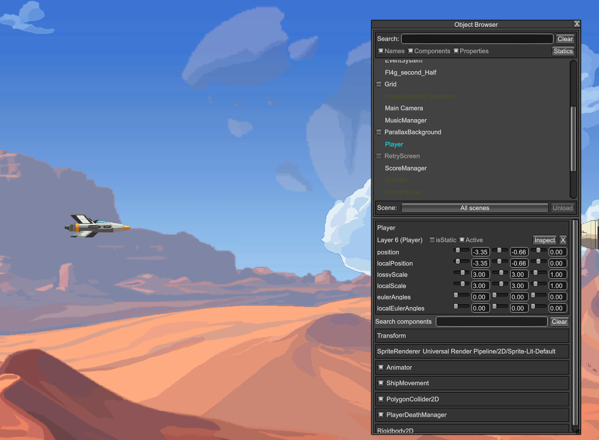
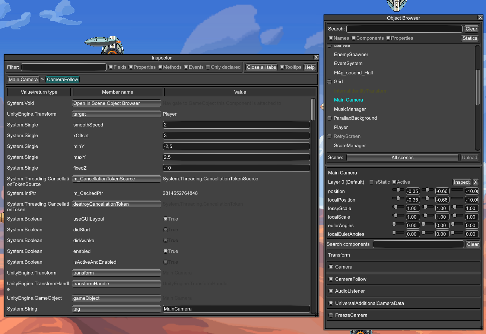
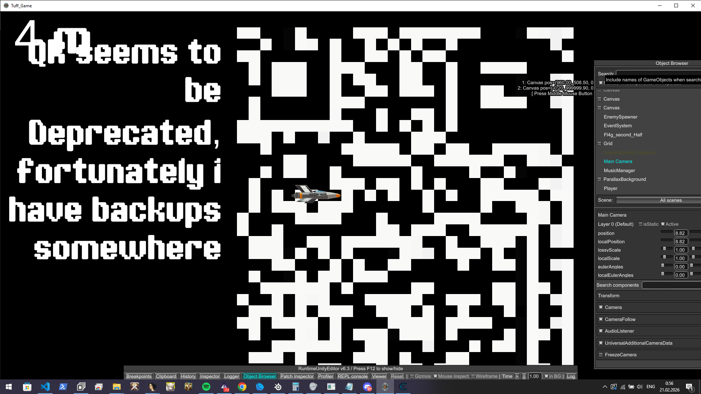
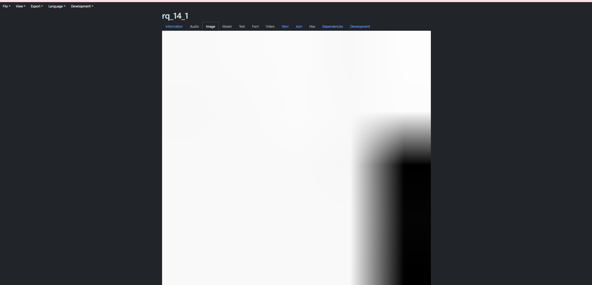

## Challenge Description

My friend Kekwman has challenged me to defeat this game, reach a million metres and help me defeat his score.

## Initial Analysis

When we download the files we can see that we have a Unity Mono game. The goal is clear — reach 1 000 000 metres.

## Step 1 — Getting the first flag part with Cheat Engine

My first thought was to go 1 million meters with Cheat Engine — it works.

We can see our first part of the flag:



## Step 2 — Finding the second part with Asset Ripper

Then I tried to search for the second part and went to Asset Ripper. I saw a file called `Fl4g_second_Half`:



When we open this as an image we can see:


We can see the text: **"think vertically"**

## Step 3 — Runtime Debugging with BepInEx + RuntimeUnityEditor

After long searching attempts at source code I found text about debugging — I thought, why not?

- Mod loader: [BepInEx](https://github.com/BepInEx/BepInEx)
- Debugger: [RuntimeUnityEditor](https://github.com/ManlyMarco/RuntimeUnityEditor)

"Think vertically" gave me the idea to go **up** to 1 million meters.

First we can choose `Player` in the Object Browser and disable `PolyGon2D Collider` to not die:



Then I tried to set the ship coordinates but it returns to normal. I went to the camera:



We can see `maxY` — we can change it to `1E+10` and now we can fly out of bounds. Then we set the camera Y position to `1 000 000`.

And we can see this:



We can see the text: **"QR seems to be Deprecated, fortunately I have backups somewhere"**

## Step 4 — Finding the QR Code in Assets

Now we know our target is a QR code. If there's no QR in the game we need to return to Asset Ripper.

When exploring assets I go to `Sprite Data Storage` and find a lot of files like `rq_14_1`:



We can see this looks like a part of a QR. We can export the data with Asset Ripper and ask GPT to write a script to stitch all parts into one image:

```python
import os
import re
from PIL import Image, UnidentifiedImageError

folder = "."

pattern = re.compile(r"rq_(\d+)_(\d+)\.png$", re.IGNORECASE)

tiles = []
max_row = 0
max_col = 0

for file in os.listdir(folder):
    match = pattern.match(file)
    if not match:
        continue

    full_path = os.path.join(folder, file)

    if not os.path.isfile(full_path):
        continue

    row = int(match.group(1))
    col = int(match.group(2))

    tiles.append((row, col, file))

    max_row = max(max_row, row)
    max_col = max(max_col, col)

if not tiles:
    print("Нема валідних rq_*.png файлів")
    exit()

# знайти перший реальний PNG
sample = None
for _, _, file in tiles:
    try:
        sample = Image.open(os.path.join(folder, file))
        sample.verify()  # перевірка валідності
        sample = Image.open(os.path.join(folder, file))  # reopen після verify
        break
    except (UnidentifiedImageError, OSError):
        continue

if sample is None:
    print("Жоден PNG не вдалося відкрити")
    exit()

tile_w, tile_h = sample.size

canvas = Image.new("RGBA", ((max_col + 1) * tile_w, (max_row + 1) * tile_h))

for row, col, file in tiles:
    try:
        img = Image.open(os.path.join(folder, file))
    except (UnidentifiedImageError, OSError):
        print(f"Пропущено битий файл: {file}")
        continue

    x = col * tile_w
    y = row * tile_h
    canvas.paste(img, (x, y))

canvas.save("result.png")
print("Готово. result.png створено.")
```

After running the script we get the assembled QR code:


## Flag

`BITSCTF{Th1$_14_D3f1n1t3ly_Th3_fl4g}`

